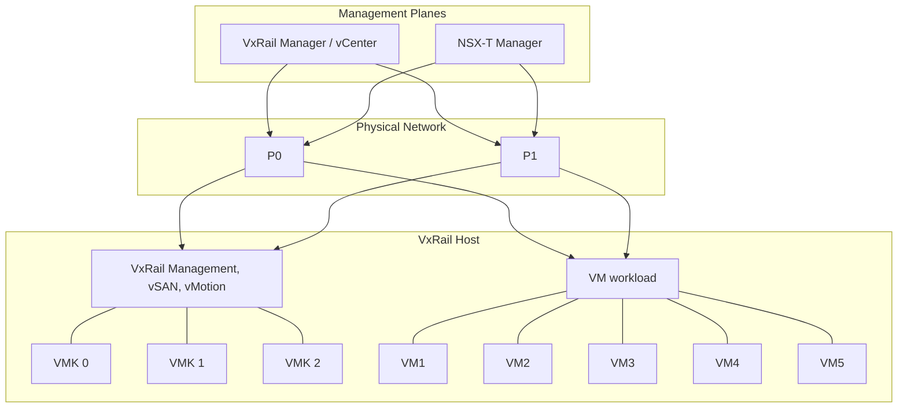

# Welcome to VTeamops Docs: Your Guide to Everything Awesome

## VMware vSphere 8 Foundations  
**Duration:** 75 Hrs

---

## Key Topics

- vSphere Editions and Features
- vSphere Architecture and Solutions
- vCenter Server Installation and Configuration
- ESXi Installation and Configuration
- Site Recovery Manager 8.x (Install, Configure & Manage)
- vSAN Installation and Configuration
- Disaster Recovery with Site Recovery Manager
- Site Recovery Manager Architecture and Deployment
- Inventory Mappings and Replication
- Protection Groups and Recovery Plans
- VMware vSphere Automation (PowerCLI / Ansible / Terraform)
- Monitoring and Troubleshooting
- Troubleshooting Scenarios

---

## vSphere 8 Architecture Overview

